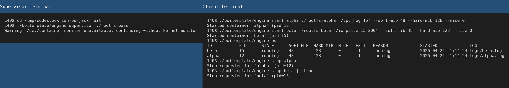
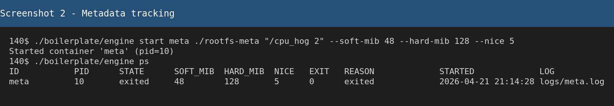
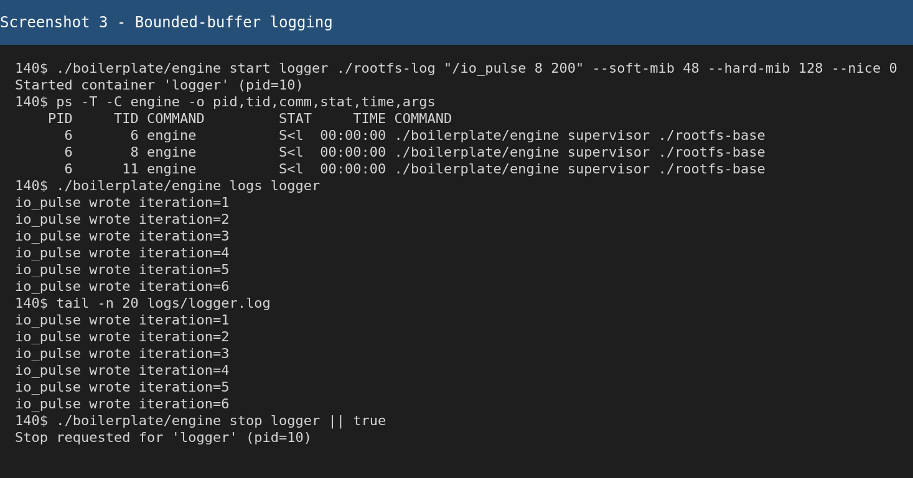
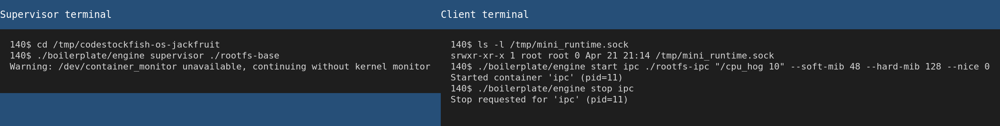
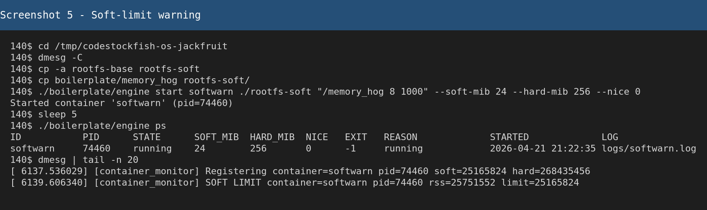
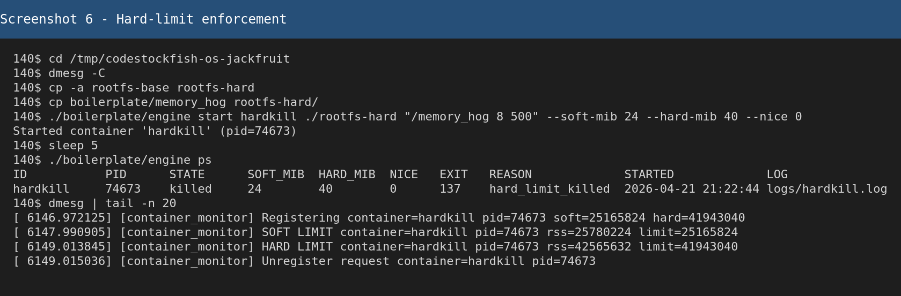
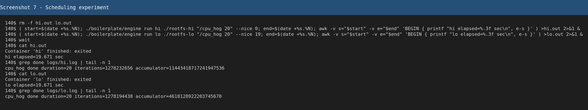
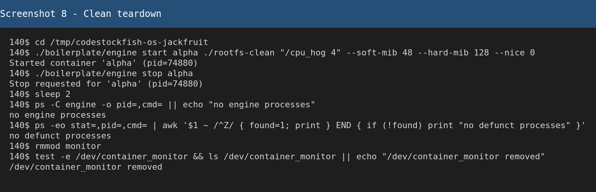

# Multi-Container Runtime

## 1. Team Information

- Team Member 1: Debargho Banerji - `PES1UG24CS141`
- Team Member 2: Debaditya Chakrabarti - `PES1UG24CS140`

## 2. Build, Load, and Run Instructions

### Environment

- Ubuntu 22.04 or 24.04 VM
- Secure Boot disabled for kernel module loading
- Root privileges required for module load, namespace setup, `chroot()`, and `/proc` mounting

### Install Dependencies

```bash
sudo apt update
sudo apt install -y build-essential linux-headers-$(uname -r) wget
```

### Build and Preflight

From the repository root:

```bash
make
```

CI-safe smoke check:

```bash
make ci
```

Optional environment check:

```bash
cd boilerplate
chmod +x environment-check.sh
sudo ./environment-check.sh
cd ..
```

### Prepare the Alpine Root Filesystem

```bash
mkdir -p rootfs-base
wget https://dl-cdn.alpinelinux.org/alpine/v3.20/releases/x86_64/alpine-minirootfs-3.20.3-x86_64.tar.gz
tar -xzf alpine-minirootfs-3.20.3-x86_64.tar.gz -C rootfs-base
cp boilerplate/cpu_hog rootfs-base/
cp boilerplate/io_pulse rootfs-base/
cp boilerplate/memory_hog rootfs-base/
```

Create one writable copy per container before each run:

```bash
cp -a rootfs-base rootfs-alpha
cp -a rootfs-base rootfs-beta
```

### Load the Kernel Module and Start the Supervisor

```bash
sudo insmod boilerplate/monitor.ko
ls -l /dev/container_monitor
sudo ./boilerplate/engine supervisor ./rootfs-base
```

### CLI Contract Implemented

```bash
sudo ./boilerplate/engine start <id> <container-rootfs> "<command>" [--soft-mib N] [--hard-mib N] [--nice N]
sudo ./boilerplate/engine run   <id> <container-rootfs> "<command>" [--soft-mib N] [--hard-mib N] [--nice N]
sudo ./boilerplate/engine ps
sudo ./boilerplate/engine logs <id>
sudo ./boilerplate/engine stop <id>
```

### Cleanup

Stop the supervisor with `Ctrl+C`, then clean up:

```bash
pgrep -af "/boilerplate/engine" || echo "no engine processes"
ps -ef | grep "[d]efunct" || echo "no defunct processes"
sudo rmmod monitor
make clean
```

## 3. Demo with Screenshots

### Screenshot 1 - Multi-container Supervision

Caption: One supervisor manages two live containers at the same time, and `ps` shows both tracked records together.



### Screenshot 2 - Metadata Tracking

Caption: The `ps` output includes container ID, PID, state, memory limits, nice value, exit status, reason, start time, and log path.



### Screenshot 3 - Bounded-Buffer Logging

Caption: The logging pipeline captures container output into `logs/logger.log`, `engine logs` can replay it, and the thread listing shows the active producer/consumer pipeline.



### Screenshot 4 - CLI and IPC

Caption: The supervisor remains running while a short-lived CLI client issues commands over the UNIX domain socket control channel.



### Screenshot 5 - Soft-Limit Warning

Caption: The kernel monitor emits a soft-limit warning in `dmesg`, while supervisor metadata still shows the container as running.



### Screenshot 6 - Hard-Limit Enforcement

Caption: After crossing the hard limit, the kernel monitor kills the container and the supervisor records the final reason as `hard_limit_killed`.



### Screenshot 7 - Scheduling Experiment

Caption: Two CPU-bound containers run concurrently with different `nice` values. Since `cpu_hog` is time-based, both runs last about the same wall-clock time, but the higher-priority run completes more loop iterations.



### Screenshot 8 - Clean Teardown

Caption: After shutdown, no `engine` processes remain, no defunct processes are left behind, and `/dev/container_monitor` is removed after unloading the module.



## 4. Engineering Analysis

### Isolation Mechanisms

Each container is created with `clone()` using `CLONE_NEWPID`, `CLONE_NEWUTS`, and `CLONE_NEWNS`, so the child gets an isolated PID namespace, hostname namespace, and mount table. The child marks the mount tree private, enters its assigned filesystem with `chroot()`, changes to `/`, and mounts a fresh `/proc`. That isolates process visibility and the filesystem view, while the host kernel, scheduler, and physical memory remain shared.

### Supervisor and Process Lifecycle

The long-running supervisor owns the global container table, logging pipeline, signal handling, and cleanup. Short-lived CLI clients connect over a UNIX domain socket, send one request, receive one response, and exit. `SIGCHLD` handling plus `waitpid(..., WNOHANG)` allows the supervisor to reap child processes promptly and preserve final metadata such as exit code, signal, and stop reason.

### IPC, Threads, and Synchronization

The control path uses a UNIX domain socket between CLI clients and the supervisor. The logging path uses pipes from each container's `stdout` and `stderr` into the supervisor. Producer threads read pipe data and push it into a bounded circular buffer. A logger thread pops entries and writes them into per-container log files. The bounded buffer uses one mutex and two condition variables so producers block when the queue is full, consumers block when it is empty, and shutdown can wake both sides cleanly. Container metadata uses a separate mutex to avoid races between CLI commands, child reaping, and stop escalation.

In kernel space, the monitored-process list uses a mutex because both the `ioctl` path and the delayed-work monitor path run in sleepable context. That lets the monitor safely call RSS helpers and free list nodes without doing sleepable work in timer interrupt context.

### Memory Management and Enforcement

The kernel module tracks RSS because RSS reflects the amount of physical memory currently resident for a process. It does not equal total virtual address space, and it does not capture every kernel-side memory overhead, but it is a useful enforcement metric. A soft limit is a warning threshold and is reported only once. A hard limit is an enforcement threshold and results in `SIGKILL`. Kernel-space enforcement is important because the kernel has direct authority over process accounting and signal delivery.

### Scheduling Behavior

The runtime uses Linux's default scheduler and exposes `nice` values through the CLI so experiments can vary scheduling weight without changing the kernel scheduler itself. CPU-bound workloads compete directly for processor time, while I/O-bound workloads naturally sleep between operations. Running them concurrently shows how Linux balances fairness, responsiveness, and throughput.

## 5. Design Decisions and Tradeoffs

### Namespace Isolation

- Design choice: PID, UTS, and mount namespaces with `chroot()`
- Tradeoff: `chroot()` is simpler than `pivot_root()`, but it is a weaker filesystem jail
- Justification: it satisfies the assignment scope with lower implementation complexity

### Supervisor Architecture

- Design choice: one long-lived supervisor plus short-lived CLI clients
- Tradeoff: this requires an explicit control-plane IPC design
- Justification: it centralizes metadata, reaping, logging, and cleanup

### IPC and Logging

- Design choice: UNIX domain socket for commands and pipe-based logging into a bounded buffer
- Tradeoff: the design is more complex than direct writes because it needs queue synchronization and thread management
- Justification: it clearly demonstrates two IPC mechanisms and a producer-consumer logging pipeline

### Kernel Monitor

- Design choice: character device plus `ioctl` registration with periodic delayed-work RSS checks
- Tradeoff: sampling is simpler than event-driven accounting but not instantaneous
- Justification: it keeps the kernel-user contract small while still supporting soft warnings and hard kills

### Scheduling Experiment

- Design choice: reusable workload binaries with `nice` as the scheduling control
- Tradeoff: `nice` adjusts scheduler weight but does not expose every scheduling knob
- Justification: it is easy to reproduce and directly tied to Linux scheduling policy

## 6. Scheduler Experiment Results

Record the final Ubuntu VM measurements from Screenshot 7 here before submission. Because `cpu_hog` is a fixed-duration CPU-bound workload, the more useful comparison is loop progress under different `nice` values rather than only wall-clock completion time.

Example format:

| Experiment | Workloads | Configuration | Measurement | Observation |
| --- | --- | --- | --- | --- |
| CPU vs CPU | `hi` vs `lo` using `cpu_hog 20` | `nice 0` vs `nice 19` | `hi = <fill> sec, <fill> iterations`; `lo = <fill> sec, <fill> iterations` | The higher-priority run should make more forward progress in the same fixed-duration window |

Raw output block to replace with your actual run:

```text
Container 'hi' finished: exited
hi elapsed=<fill> sec
cpu_hog done duration=20 iterations=<fill> accumulator=<fill>

Container 'lo' finished: exited
lo elapsed=<fill> sec
cpu_hog done duration=20 iterations=<fill> accumulator=<fill>
```
