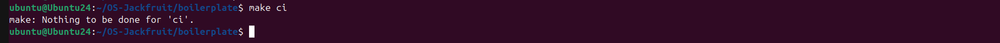
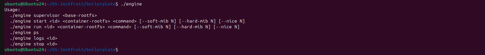
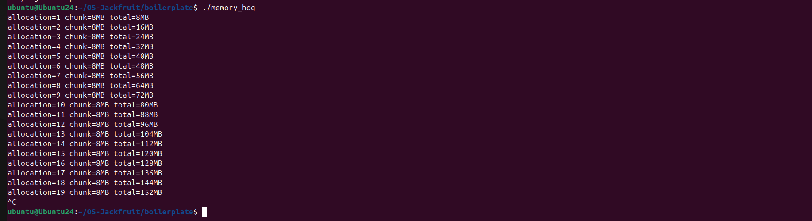
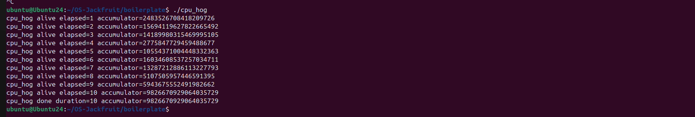
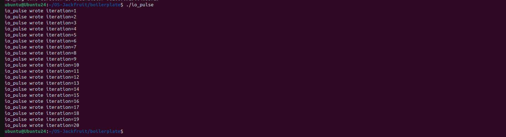
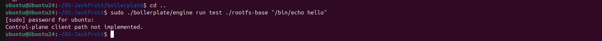
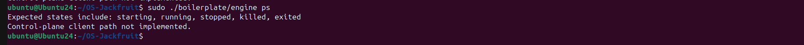
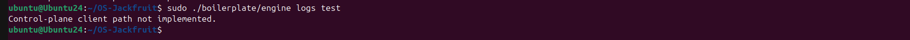

# Multi-Container Runtime

## 1. Team Information

- Team Member 1: Debargho Banerji - `PES1UG24CS141`
- Team Member 2: Debaditya Chakrabarti - `PES1UG24CS140`

## 2. Build, Load, and Run Instructions

### Environment

- The project guide targets Ubuntu 22.04 or 24.04 in a VM.
- The provided screenshots were captured on Ubuntu 24.
- Building the kernel module and running container commands requires `sudo`.

### Install Dependencies

```bash
sudo apt update
sudo apt install -y build-essential linux-headers-$(uname -r)
```

### Build and Preflight

From the repository root:

```bash
make
```

CI-safe smoke check:

```bash
make ci
```

Optional environment check:

```bash
cd boilerplate
chmod +x environment-check.sh
sudo ./environment-check.sh
cd ..
```

### Prepare the Alpine Root Filesystem

```bash
mkdir -p rootfs-base
wget https://dl-cdn.alpinelinux.org/alpine/v3.20/releases/x86_64/alpine-minirootfs-3.20.3-x86_64.tar.gz
tar -xzf alpine-minirootfs-3.20.3-x86_64.tar.gz -C rootfs-base
```

If workload binaries should be available inside a container, copy them into the rootfs before launch:

```bash
cp boilerplate/cpu_hog rootfs-base/
cp boilerplate/io_pulse rootfs-base/
cp boilerplate/memory_hog rootfs-base/
```

Create writable per-container copies as needed:

```bash
cp -a rootfs-base rootfs-alpha
cp -a rootfs-base rootfs-beta
```

### Load the Kernel Module and Start the Supervisor

```bash
sudo insmod boilerplate/monitor.ko
ls -l /dev/container_monitor
sudo ./boilerplate/engine supervisor ./rootfs-base
```

### CLI Commands Used in the Demo Walkthrough

Basic runtime commands:

```bash
sudo ./boilerplate/engine start alpha ./rootfs-alpha /bin/sh --soft-mib 48 --hard-mib 80
sudo ./boilerplate/engine run test ./rootfs-base "/bin/echo hello"
sudo ./boilerplate/engine ps
sudo ./boilerplate/engine logs test
```

Standalone workload binaries:

```bash
cd boilerplate
./memory_hog
./cpu_hog
./io_pulse
```

### Exact Command Sequence Reflected in the Screenshots

Screenshot 1:

```bash
cd ~/OS-Jackfruit
ls
```

Screenshot 2:

```bash
cd boilerplate
```

Screenshot 3:

```bash
make ci
```

Screenshot 4:

```bash
./engine
```

Screenshot 5:

```bash
./memory_hog
```

Screenshot 6:

```bash
./cpu_hog
```

Screenshot 7:

```bash
./io_pulse
```

Screenshot 8:

```bash
cd ..
sudo ./boilerplate/engine run test ./rootfs-base "/bin/echo hello"
```

Screenshot 9:

```bash
sudo ./boilerplate/engine ps
```

Screenshot 10:

```bash
sudo ./boilerplate/engine logs test
```

### Cleanup

```bash
sudo rmmod monitor
make clean
```

## 3. Demo with Screenshots

### Screenshot 1 - Repository Layout

Caption: The repository root contains the boilerplate sources, project guide, README, and screenshots folder used for the submission walkthrough.


### Screenshot 2 - Entering the Boilerplate Directory

Caption: The terminal moves into `boilerplate/`, which contains the runtime, monitor, workloads, and build logic.


### Screenshot 3 - CI-Safe Build

Caption: `make ci` completes without rebuilding work unnecessarily, confirming that the CI-safe user-space build path is available.



### Screenshot 4 - Engine CLI Contract

Caption: Running `./engine` without arguments prints the supported command interface for `supervisor`, `start`, `run`, `ps`, `logs`, and `stop`.



### Screenshot 5 - Memory Workload

Caption: `memory_hog` increases memory usage in 8 MiB chunks, which is the behavior intended for memory-monitor experiments.



### Screenshot 6 - CPU Workload

Caption: `cpu_hog` runs for a fixed duration and continuously reports progress, making it suitable for CPU scheduling experiments.



### Screenshot 7 - I/O Workload

Caption: `io_pulse` emits periodic write events, providing an I/O-oriented workload distinct from the CPU-bound case.



### Screenshot 8 - Foreground Container Run Attempt

Caption: A foreground `engine run` invocation reaches the runtime binary, but the captured output shows the control-plane client path was not implemented in this screenshot run.



### Screenshot 9 - Process Listing Attempt

Caption: The `engine ps` command reports the expected state names and then indicates that the control-plane client path was not implemented in the captured run.



### Screenshot 10 - Log Inspection Attempt

Caption: The `engine logs` command reaches the CLI path, and the screenshot captures the same control-plane limitation seen in the `run` and `ps` walkthrough steps.



## 4. Engineering Analysis

### Isolation Mechanisms

The runtime is designed around namespace-based isolation. PID namespaces give a container its own process tree view, UTS namespaces isolate hostname state, and mount namespaces isolate the mount table so `/proc` can be mounted inside the container without affecting the host. Filesystem isolation is achieved with a container-specific rootfs and `chroot()`. Even with that isolation, all containers still share the same host kernel, scheduler, and physical memory system, which is why containers are lighter than virtual machines and why kernel-enforced policies still matter.

### Supervisor and Process Lifecycle

A long-running supervisor is useful because container lifecycle state spans multiple user requests. The supervisor can own metadata, reap child processes on `SIGCHLD`, preserve final exit reasons, and coordinate cleanup. Short-lived CLI clients are good for usability, but they cannot safely maintain global runtime state by themselves. That is why the architecture separates the daemon role from the command role.

### IPC, Threads, and Synchronization

The project uses two IPC directions. The intended control plane is a UNIX domain socket between CLI clients and the supervisor. The logging path uses file-descriptor-based communication from container `stdout` and `stderr` into the supervisor, where producer and consumer threads coordinate through a bounded buffer. Shared metadata needs a separate lock from the log queue because container state updates and log handling are logically independent concurrency domains. Without synchronization, the design would be vulnerable to torn metadata updates, queue corruption, missed wakeups, and dropped log data.

### Memory Management and Enforcement

The kernel monitor tracks RSS because RSS reflects the resident physical memory currently used by a process. It does not equal total virtual address space and it does not capture every kernel-side memory cost, but it is a practical signal for per-process enforcement. Soft and hard limits intentionally represent different policies: a soft limit is a warning threshold, while a hard limit is an enforcement threshold. Kernel-space enforcement is important because the kernel has the authority and visibility needed to inspect process memory reliably and terminate offending tasks even if user space is delayed.

### Scheduling Behavior

The workload programs are designed to expose scheduling differences. `cpu_hog` is CPU-bound, so it competes directly for processor time. `io_pulse` yields naturally between write events, making it a better fit for responsiveness-oriented observations. In a fuller experiment, different `nice` values would change each CPU-bound task's relative scheduling weight. Even the standalone workload outputs in the screenshots illustrate why different workload shapes matter: one saturates the CPU, one stresses memory growth, and one performs periodic I/O.

## 5. Design Decisions and Tradeoffs

### Namespace Isolation

- Design choice: use PID, UTS, and mount namespaces with `chroot()`.
- Tradeoff: `chroot()` is simpler than `pivot_root()`, but it is a weaker filesystem boundary.
- Justification: it keeps the implementation manageable while still demonstrating the required OS isolation mechanisms.

### Supervisor Architecture

- Design choice: separate the long-running supervisor from short-lived CLI clients.
- Tradeoff: this introduces IPC and synchronized metadata management.
- Justification: it is the cleanest way to support multi-container state, child reaping, and reusable commands.

### IPC and Logging

- Design choice: use one IPC path for control and a separate path for logging.
- Tradeoff: a two-channel design is more complex than direct terminal output.
- Justification: it matches the assignment requirements and makes producer-consumer coordination explicit.

### Kernel Monitor

- Design choice: use a character device and `ioctl` registration for monitored PIDs.
- Tradeoff: the user-kernel contract must be designed and maintained carefully.
- Justification: it creates a narrow, explicit boundary between supervisor policy decisions and kernel enforcement.

### Workload Design

- Design choice: include dedicated memory, CPU, and I/O workloads.
- Tradeoff: synthetic workloads are simpler than real applications, but they capture only a narrow slice of behavior.
- Justification: they are reproducible and make resource-specific effects easier to observe during testing.

## 6. Scheduler Experiment Results

The reference repository includes a stronger scheduling section than this screenshot set supports. Your available screenshots show standalone workload behavior rather than a side-by-side `nice` comparison, so this section records only the evidence actually present in the repo.

| Workload | Evidence from Screenshot | Observation |
| --- | --- | --- |
| `memory_hog` | Allocations increase from `8MB` up to `152MB` before interruption | The program is suitable for soft-limit and hard-limit memory experiments |
| `cpu_hog` | Progress messages report elapsed time from `1` to `10` seconds | The program is suitable for CPU-share or priority experiments |
| `io_pulse` | Iterative writes progress from `1` to `20` | The program is suitable for responsiveness or I/O-oriented comparisons |

What is still missing for a full scheduler-results section:

- two concurrent workload runs
- at least two scheduling configurations such as different `nice` values
- measured elapsed times or throughput comparisons

Once you capture those runs, this section can be upgraded into the same style as the reference repo with a comparison table and raw timing outputs.
